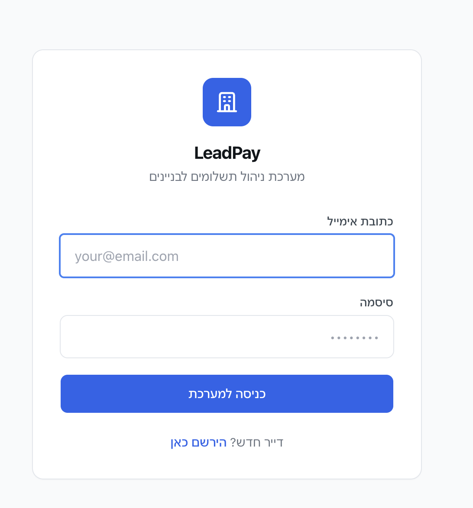
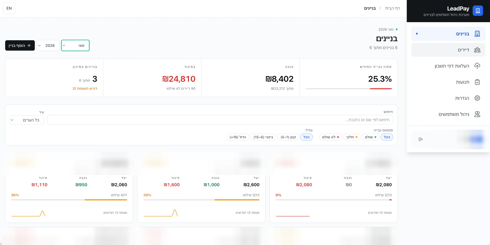
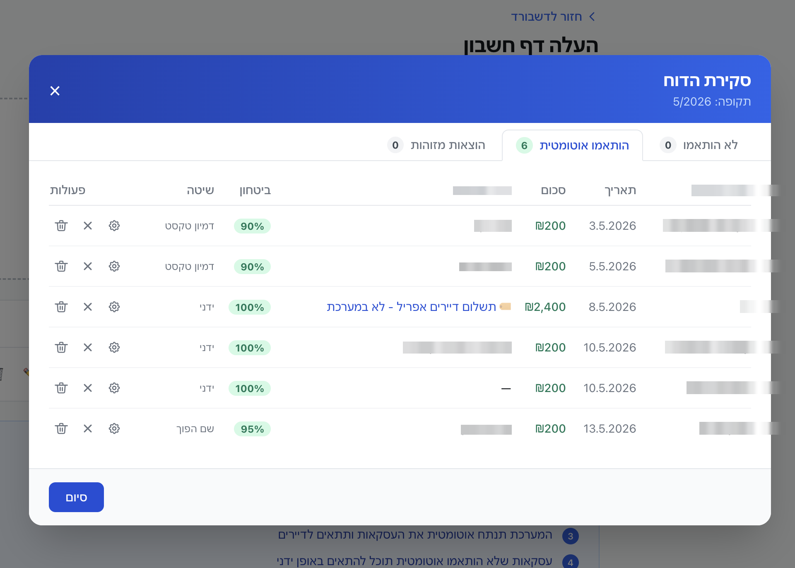
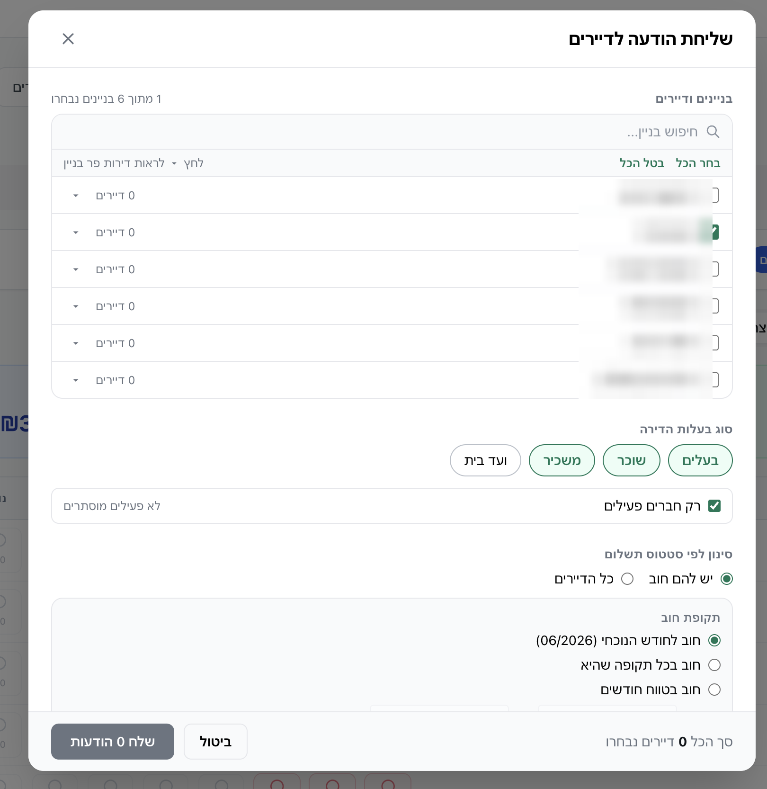
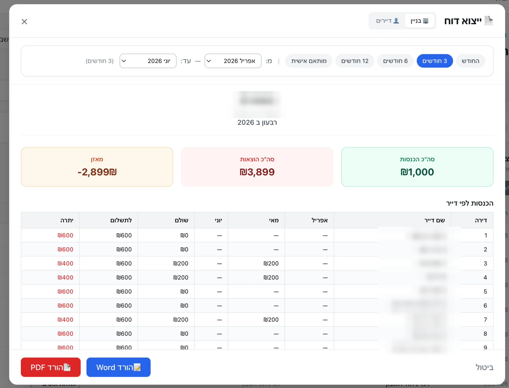

# LeadPay — Building Management Payment Tracker

> ניהול תשלומים לבניינים — דיירים, תשלומים, הוצאות, הודעות ודוחות

LeadPay automates the most painful parts of building management: matching bank-statement
transactions to tenants, keeping one trustworthy debt number per apartment, splitting
expenses and special charges, sending payment reminders and periodic reports over the
WhatsApp Cloud API, and answering tenants' replies — all in Hebrew with RTL support.

> **Public showcase snapshot.** This is a curated, read-only copy of the application
> for portfolio purposes. Some parts are **intentionally omitted** because this is a
> public repository and the app runs a real production deployment with customer data:
>
> - **Secrets & credentials** — no `.env` files; all config (`backend/.env.example`)
>   uses placeholders. Database project identifiers are redacted.
> - **Internal operations** — production runbooks, data-baseline captures, and
>   migration cutover records are not included.
> - **Internal design docs & agent guides** (`docs/plans/`, `CLAUDE.md`) are omitted.
>
> **This README describes the product as of October 2026.** The source code in this
> repository is a snapshot from **June 2026**, so later features described below — the
> per-apartment debt ledger, the Messages page and WhatsApp Cloud API, report batches
> and public links, the statement review screen — are documented here but not included
> in the code. The code that is here is complete and runnable against your own database
> and environment. It remains proprietary — see [LICENSE](LICENSE).

---

## Features

| Feature | Description |
|---------|-------------|
| Buildings | Portfolio page with KPI strip, compact building cards, and a banner for buildings whose bank statements are out of date |
| Building view | Three tabs — סיכום (summary: debtors, insights, recent transactions, category budgets), גבייה (collection matrix), הוצאות (expenses) |
| Tenants | Import from Excel, ownership type (owner / landlord / renter), committee (ועד בית) members, move-in dates, standing orders. One active payer per apartment, chosen at import |
| Bank Statements | Upload Excel/XLS from Leumi, Hapoalim, FIBI, Yahav and Mizrahi-Tefahot; de-duplicated without dropping real transactions |
| Statement Review | One review table per statement: filters, stats, who settled each row, ignore / un-ignore, "reviewed" stamp. Rows can be deleted but never edited |
| Smart Matching | Fuzzy Hebrew name matching (5 strategies) with learned payer-name memory |
| Debt Ledger | One per-apartment ledger behind every debt number in the app, always "as of today". A month is owed from the 11th. Credit (זכות) and paid-ahead months are shown separately |
| Split Suggestions | A lump payment is never split automatically — the app proposes a split over the oldest open months and due special charges, and writes it only when you accept |
| Darimpo Lump Sums | Split a Darimpo lump transfer per apartment by uploading its deposits report (דוח הפקדות) |
| Expenses | Per-building categories with monthly budgets, automatic vendor classification, bulk categorize, split expense rows, record-only one-time expenses |
| Special Charges | One-off charges split across apartments (by weight / evenly) |
| Messages (`/messages`) | One page for everything the app says to tenants and everything they say back — overview, conversations, templates, blocked, reports, settings |
| WhatsApp Cloud API | Automated sends with Meta-approved templates, interactive buttons, delivery and read receipts, opt-out keywords, auto-replies, human hand-off |
| Reports | Building, tenant, resident and combined reports as PDF / DOCX. Quarterly report batches with a review step, zip download, WhatsApp send, and a public 30-day resident link |
| Auth + Roles | JWT auth with 4 roles (Manager, Worker, Viewer, Tenant) |
| Legal pages | Public accessibility statement (Israeli IS 5568 / WCAG) and privacy policy |
| Bilingual | Hebrew RTL default, English optional |

---

## Screenshots

> Building names, addresses, and tenant/payer details are **blurred** — this is a public showcase of a live product with real customer data. Screenshots are from June 2026.

### Login


### Buildings dashboard — portfolio KPIs, per-building collection status, risk filters


### Bank-statement review — fuzzy Hebrew name matching with confidence scores


### Multi-channel reminders — select buildings, ownership type, and debt filters


### Report export — building / tenant report with PDF + DOCX export


---

## User Roles

| Role | Can Do |
|------|--------|
| Manager | Full CRUD, manage users, approve tenants |
| Worker | View + edit everything, upload statements, send messages and reports |
| Viewer | Read-only access to all data (edit controls are hidden) |
| Tenant | Read-only access to their own building |

### Account Flows
- Manager / Worker / Viewer: Manager sends an email invite → user sets password → account active
- Tenant: Self-registers at `/register` → status = `pending` → Manager approves
- Empty database: `/setup` creates the first manager

---

## Quick Start

### Prerequisites
- Python 3.11
- Node.js 18+
- PostgreSQL (local Postgres for development and tests)
- WeasyPrint system libraries (Pango) for PDF reports — `brew install pango` on macOS

### 1 — Local database

```bash
brew install postgresql@18
brew services start postgresql@18
createuser -s leadpay
createdb -O leadpay -E UTF8 leadpay_test
```

### 2 — Backend

```bash
cd backend

python3.11 -m venv venv
source venv/bin/activate         # Windows: venv\Scripts\activate
pip install -r requirements.txt

cp .env.example .env
# Edit .env — set DATABASE_URL (local) and APP_SECRET_KEY

alembic upgrade head

# Create the first manager account (or use /setup in the browser)
python3 scripts/create_manager.py --email admin@example.com --name "Admin" --password "yourpassword"

uvicorn app.main:app --reload
```

Backend runs at **http://localhost:8000** — API docs at **/docs** (disabled in production).

All messaging providers are optional. Without credentials each client runs in **stub mode**:
it logs the message it would have sent and the UI shows a demo-mode banner, so the whole
flow can be tried locally.

### 3 — Frontend

```bash
cd frontend
npm install
echo "VITE_API_URL=http://localhost:8000" > .env.local
npm run dev
```

Frontend runs at **http://localhost:5173**

---

## Project Structure

```
leadpay/
├── backend/
│   ├── app/
│   │   ├── models/            # SQLAlchemy models (one file per entity)
│   │   ├── routers/           # FastAPI endpoints under /api/v1 (see below)
│   │   ├── schemas/           # Pydantic request/response schemas
│   │   ├── services/          # Business logic — apartment_debt (the ledger),
│   │   │                      #   matching_engine, excel_parser, darimpo_*,
│   │   │                      #   split_suggestion, statement_review,
│   │   │                      #   messaging_service, whatsapp_cloud_service,
│   │   │                      #   conversation_service, report_batch_service,
│   │   │                      #   report_pdf / report_docx / report_html, …
│   │   ├── templates/         # Jinja templates for HTML/PDF reports
│   │   ├── dependencies/      # JWT guards + RBAC helpers
│   │   ├── database.py        # SQLAlchemy engine + session
│   │   └── main.py            # App factory, CORS, security headers
│   ├── alembic/               # Database migrations
│   ├── scripts/               # create_manager, WhatsApp template submit/verify, backfills
│   ├── tests/                 # pytest suite (~1,200 tests)
│   ├── Procfile               # Railway: migrate, then start
│   ├── nixpacks.toml          # WeasyPrint system libraries on Railway
│   └── requirements.txt
│
└── frontend/
    ├── src/
    │   ├── pages/             # Route-level pages
    │   ├── components/        # building/, messages/, review/, upload/,
    │   │                      #   transactions/, modals/, shared/, layout/, ui/
    │   ├── context/           # AuthContext, ConfigContext
    │   ├── hooks/             # Custom hooks
    │   ├── services/          # api.ts — central typed fetch client
    │   ├── types/             # Shared TypeScript interfaces
    │   ├── lib/               # Helpers
    │   └── i18n/              # he/en translations
    └── vercel.json            # SPA routing for Vercel
```

### API routers (`/api/v1`)

| Router | Purpose |
|--------|---------|
| `auth` | Login, refresh, register, first-run setup, invite accept |
| `users` | Invite, approve, change role, delete |
| `buildings` | CRUD, statement freshness, building summary, building report |
| `tenants` | CRUD, import, make-active payer, opted-out / paused tenants, tenant reports |
| `statements` | Upload, review, match / unmatch / ignore, allocations, split suggestion, Darimpo preview |
| `transactions` | Global transaction list, manual entries |
| `payments` | Ledgers, debts, payment history, portfolio stats |
| `expenses` | Categories, budgets, categorize |
| `special_charges` | One-off charges |
| `collecting` | Collection matrix |
| `imports` | Expected monthly amounts |
| `messages` | Build, preview and send reminders on every channel |
| `conversations` | Threads, replies, quick replies, templates and Meta submission, quota |
| `webhooks` | WhatsApp webhook (verify + receive) |
| `reports` | Report batches — create, review, files, zip, send |
| `public_reports` | Token-based resident report link (no login) |
| `settings` | App config — messaging, risk thresholds |

---

## Workflow

```
1. Create Building        → Buildings page
2. Import Tenants         → Tenants page → Excel import (pick the active payer per apartment)
3. Import Monthly Amounts → from the building's tenants Excel (expected fees)
4. Upload Bank Statement  → העלאת דפי חשבון → drag-and-drop Excel
5. Review the Statement   → auto-matched rows; match / split / ignore the rest; mark reviewed
6. Split Lump Payments    → accept split suggestions, or upload a Darimpo deposits report
7. Track Expenses         → categorize non-payment rows; set budgets; add special charges
8. Check the Building     → סיכום tab: debtors, insights, budgets
9. Send Messages          → הודעות → reminders, announcements, welcome messages
10. Send Reports          → quarterly report batch → review → send or share a link
11. Manage Users          → /users (Manager only)
```

---

## Debt Rules

Every debt number — screens, reminders, reports, the buildings page — is a slice of one
ledger, `backend/app/services/apartment_debt.py`. Nothing else computes debt.

- A month is owed from the **11th**. Paying on the 10th is on time.
- Months start at the earliest tenant move-in date, else the building's default start date.
- Fee: a frozen period amount, else the apartment fee, else the building fee.
- Debt belongs to the **apartment** — payments from every tenant record count — and is shown
  on its active payer.
- Totals net across months; **credit is its own number**. Months not yet due are never debt,
  only "paid ahead".
- Every debt number is **as of today**, whatever period a screen or report shows.

---

## Database Schema

| Table | Purpose |
|-------|---------|
| `users` | Auth: email, hashed_password, role, status, building_id |
| `buildings` | Building info, bank details, default fee and start date |
| `apartments` | Units within a building (weight, fee, standing order) |
| `tenants` | Tenant details, ownership type, phone, active payer, committee flag, move-in dates, opt-out |
| `bank_statements` | Uploaded statement files (period, building, reviewed stamp) |
| `transactions` | Individual rows parsed from statements |
| `transaction_allocations` | Splits of a transaction to apartments/months (payments) or expense labels |
| `name_mappings` | Learned match memory (payer name → tenant) |
| `apartment_period_debt` | Per-apartment, per-month fee records |
| `expense_categories` | Per-building expense categories and monthly budgets |
| `vendor_mappings` | Learned vendor → category classification |
| `special_charges` | One-off charges split across apartments |
| `messages` | Every message in and out — channel, direction, delivery status, media, reactions |
| `report_batches` | A report send: frozen data, review state, delivery |
| `report_artifacts` | Rendered report files and their public-link tokens |
| `app_config` | App-wide configuration (risk thresholds, messaging settings) |

---

## Fuzzy Matching Engine

The engine uses 5 strategies to match Hebrew bank-statement names to tenants:

1. Exact match — direct string comparison after normalization
2. Reversed name — handles "first last" vs "last first"
3. Fuzzy match — Levenshtein distance via RapidFuzz
4. Token match — word-level matching for abbreviations (e.g. "גיא מ" → "גיא מן")
5. Amount match — cross-validates with the expected monthly fee

Hebrew normalization: final letters are collapsed (ך→כ, ם→מ, ן→נ, ף→פ, ץ→צ).

Auto-confirm at ≥90% confidence. Below 70% → unmatched (manual review).

---

## Messages

The הודעות page (`/messages`) is where everything the app says to a tenant goes out and
everything they say back arrives. It carries payment reminders, periodic reports, building
welcome messages and general announcements. (`/whatsapp` redirects here.)

| Tab | What it does |
|-----|--------------|
| סקירה | Overview of every channel over a send-date range; WhatsApp gets a delivery funnel |
| שיחות | Conversation threads, in-app replies, quick replies |
| תבניות | Template board and conversation tree, custom templates, submission to Meta, monthly quota |
| חסומים | Opted-out and paused tenants, error reports |
| דוחות | Past report batches |
| הגדרות | Representative phone, auto-reply, escalation alerts |

### Channels

| Channel | Status |
|---------|--------|
| WhatsApp Cloud API (Meta) | Live. Approved templates, interactive buttons, delivery + read receipts |
| WhatsApp link (`wa.me`) | Manual — opens WhatsApp with the text filled in |
| Email (Resend) | Client built; stub mode until credentials are set |
| SMS (Inforu) | Client built; stub mode until credentials are set |

Only WhatsApp Cloud API returns delivery receipts, so only it gets a funnel. Other channels
report what is knowable: sent and failed.

### Replies and automation
- Reminders escalate and carry buttons ("payment details", "talk to a representative").
- Inbound messages arrive by webhook. Free text gets an automated reply only after the
  sender has stopped typing for 60 seconds, so a question sent in three messages gets one answer.
- A reply sent from the page takes over the thread and suppresses the bot.
- Opt-out keywords (e.g. "הסר") stop reminders to that tenant.
- Tenant messages never contain emoji.

---

## Reports

- Four document kinds: **tenant**, **building**, **building — resident view** (no other
  residents' names), and **combined**.
- Exported as PDF or DOCX with the LEAD logo and palette, formatted for Hebrew RTL.
- Reports read the debt ledger and state "חוב נכון ל-DD/MM/YYYY".
- **Report batches**: pick a quarter → the data is frozen → a review screen flags anything
  suspicious → send by WhatsApp (document or link), or download everything as a zip.
- **Public resident link**: no login, valid 30 days, revocable. Batches are kept 180 days.

---

## Security

- JWT access tokens (30 min) + refresh tokens (30-day sliding window)
- bcrypt password hashing
- RBAC on every endpoint; edit controls hidden from Viewer and Tenant
- CORS restricted to `FRONTEND_URL`
- Security headers: `X-Content-Type-Options`, `X-Frame-Options`, `Referrer-Policy`
- File upload validation: Excel only, max 10 MB
- Rate limiting on login + upload endpoints
- WhatsApp webhook verifies Meta's signature and rejects everything when `META_APP_SECRET` is unset
- Public report links are random tokens, expire after 30 days, and can be revoked
- API docs disabled in production (`APP_ENV=production`)

---

## Environment Variables

### Backend `backend/.env`

See `backend/.env.example` for the annotated template.

```env
DATABASE_URL=postgresql://leadpay:<password>@localhost:5432/leadpay_test
APP_SECRET_KEY=<run: openssl rand -hex 32>
APP_ENV=development              # production disables /docs
FRONTEND_URL=http://localhost:5173
ACCESS_TOKEN_EXPIRE_MINUTES=30
REFRESH_TOKEN_EXPIRE_DAYS=30

# Public report links — base URL of this API (falls back to RAILWAY_PUBLIC_DOMAIN)
PUBLIC_API_URL=https://your-backend.example.com

# WhatsApp Cloud API (optional — stub mode without them)
META_WHATSAPP_TOKEN=
META_PHONE_NUMBER_ID=
META_WABA_ID=
META_APP_SECRET=                 # required for the webhook
META_WEBHOOK_VERIFY_TOKEN=

# SMS — Inforu (optional)
INFORU_USERNAME=
INFORU_API_TOKEN=
INFORU_SENDER_ID=

# Email — Resend (optional)
RESEND_API_KEY=
RESEND_FROM_EMAIL=
```

Production values live only in the hosting provider's env vars — never in a local file.

### Frontend `frontend/.env.local`

```env
VITE_API_URL=http://localhost:8000   # must include the scheme; baked in at build time
```

---

## Production Deployment

| Service | Platform |
|---------|----------|
| Frontend | Vercel — root directory `frontend`, auto-deploys from `master` |
| Backend | Railway — root directory `backend`, auto-deploys from `master` |
| Database | Railway Postgres (moved from Supabase on 2026-07-30) |

- Railway reads `Procfile` → `alembic upgrade head && uvicorn app.main:app --host 0.0.0.0 --port $PORT`.
- `nixpacks.toml` installs the WeasyPrint system libraries.
- `FRONTEND_URL` on Railway must exactly match the Vercel domain (CORS).
- `VITE_API_URL` on Vercel must include `https://` and needs a redeploy after a change.
- Seed the first manager with `/setup`, or from a Railway shell:
  `python3 scripts/create_manager.py --email ... --password ...`
- Point the Meta app's webhook at `https://<backend>/api/v1/webhooks/whatsapp`.

### Making Changes

Work on a topic branch (`feat/…`, `fix/…`, `chore/…`). **`master` is the production deploy
trigger** — merging to it ships to Vercel and Railway.

---

## Testing

```bash
cd backend
pytest
```

Each pytest run creates its own throwaway database on the local Postgres server, migrates
it, and drops it on exit, so parallel runs never collide. The full suite takes a few seconds.
`tests/conftest.py` refuses to run against a production database and strips messaging
credentials, so tests can never send a real message.

```bash
cd frontend
npm run build    # TypeScript check
```

---

## Tech Stack

| Layer | Tech |
|-------|------|
| Backend | Python 3.11, FastAPI 0.115, SQLAlchemy 2.0 (sync), Alembic |
| Auth | python-jose (JWT), passlib (bcrypt), slowapi (rate limits) |
| Matching | RapidFuzz, Pandas |
| Reports | WeasyPrint (PDF), python-docx (DOCX), Jinja2 (HTML) |
| Messaging | WhatsApp Cloud API (Meta Graph API), Inforu (SMS), Resend (email) |
| Database | PostgreSQL — Railway Postgres in production, local Postgres for dev/tests |
| Frontend | React 19, TypeScript 5, Vite 7 |
| State | TanStack Query v5 |
| Routing | React Router v7 |
| Styling | Tailwind CSS v3 |
| Charts | Recharts |
| i18n | i18next |

---

## GitHub Repo

[https://github.com/itayfre/LeadPay---Public](https://github.com/itayfre/LeadPay---Public)

---

## License

Proprietary — © 2026 Itay Frenkel. All rights reserved. See [LICENSE](LICENSE).
This software may not be used, copied, or distributed without express written permission.

---

*Built with [Claude Code](https://claude.ai/claude-code) — Anthropic*
